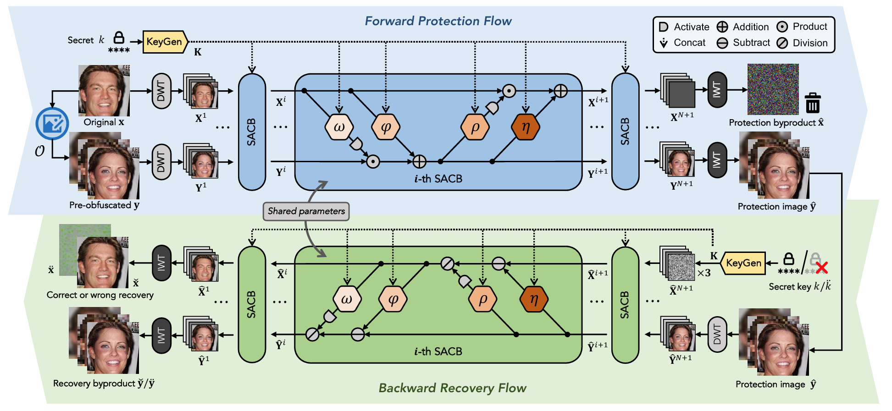

# Source Code for PRO-Face-S

Lin Yuan, Kai Liang, Xiao Pu, Yan Zhang, Jiaxu Leng, Tao Wu, Nannan Wang, Xinbo Gao. Invertible Image Obfuscation for Facial Privacy Protection via Secure Flow. IEEE Transactions on Circuits and Systems for Video Technology. Volume: 34, Issue: 7, July 2024，6077-6091. https://doi.org/10.1109/TCSVT.2023.3344809
# Introduction
This manuscript introduces a novel framework for the protection of facial privacy, termed PRO-Face S, which stands for Privacy-preserving Reversible Obfuscation of Face images via Secure flow. This framework is designed to simultaneously fulfill multiple desirable characteristics, including anonymity, diversity, reversibility, security, and lightweight operation. At the heart of PRO-Face S lies a flow-based generative model, equivalent to an invertible neural network, which processes a facial image and its pre-obfuscated counterpart to generate a privacy-protected image that closely resembles the pre-obfuscated version visually. The pre-obfuscation can take various forms, varying in type and intensity. The invertibility of the flow-based model guarantees the high-fidelity recovery of the original image from its protected state. To ensure secure guidance through the transformations between privacy protection and image recovery, a sophisticated secret key mechanism is implemented. This mechanism ensures that accurate recovery is contingent upon the possession of the correct secret key, which is predetermined by the user during the protection phase. The study also explores two modes of incorrect recovery to counteract potential malicious recovery attempts under different circumstances. Extensive experiments across multiple image datasets substantiate the superiority of the proposed framework in comparison to existing state-of-the-art methods.

An overview of our network architecture:

# Prepraration

### Dependencies

The project's runtime environment is based on Miniconda. You can use the following command to install the project's runtime environment：

``conda create --name PROFaceS --file requirements.txt``

### Face classification models
First, download the pretrained face classification checkpoints from any of the following links.
- [BaiduDisk link](https://pan.baidu.com/s/1q-s1G4aqSzcXEofDOEfeHg) (Password:`3cvh`)

Then, place the corresponding `.pth` model files under the `face/gender_model`.

### SimSwap models

To run SimSwap, you need to download its pretrained models from the following link:
- [BaiduDisk link](https://pan.baidu.com/s/1q-s1G4aqSzcXEofDOEfeHg) (Password:`3cvh`)

Then, place the file `arcface_checkpoint.tar` under `SwimSwap/arcface_model` and the three files `latest_net_*.pth` under `SwimSwap/models/checkpoints/people/`.

### FaceShifter models

To run FaceShifter, you need to download its pretrained models from the following link:
- [BaiduDisk link](https://pan.baidu.com/s/1q-s1G4aqSzcXEofDOEfeHg) (Password:`3cvh`)

Then, place the file `model_ir_se50.pth` under `FaceShifter/face_modules/` and file `G_latest.pth` under `FaceShifter/saved_models/`.

### Datasets
Our training was done is CelebA dateset, where all faces images were preprocessed to keep only the facial part. we have made our preprocessed CelebA dataset public. One many obtain the entire datasets (including the train/val/test splits and triplet files) from the following links:
- [BaiduDisk link](https://pan.baidu.com/share/init?surl=wMf-iRP5kVfeijvvZYOylQ) (Password: `dkhd`)
- [OneDrive](https://cqupteducn-my.sharepoint.com/:u:/g/personal/yuanlin_cqupt_edu_cn/EckcBzUQ-f1EgobKZGzJKPUB_g_SOxCXv5bF7e6Kx3O8Yw?e=wInwoU)

Then, place it in the directory specified by `dataset_dir` in the `config.py` file, or alternatively, modify the `dataset_dir` path to point to the location of the dataset

> At this stage, if you notice that any folders are missing, please manually create the required directories as outlined above.

# Training
Simply run `train_tcsvt.py` to start the training process.

# Testing
Simply run `test_tcsvt.py` to start the testing process. 

To perform testing, you need to download the test dataset and place it in the correct location. Below is the download link:
- [BaiduDisk link](https://pan.baidu.com/s/1vFbNzRYVM6Nr-0yTs8GrwA) (Password:`8pre`)

Then, after downloading, unzip the data and place it under the `experiments/` directory.

Then, place it in the directory specified by `dataset_dir` in the `config.py` file, or alternatively, modify the `dataset_dir` path to point to the location of the dataset

Additionally, for testing, you will need to provide a target image. Place the target image in the directory specified by `target_img_dir_test` in the `config.py` file, or alternatively, modify the `target_img_dir_test` path to point to the location of the target image.

By following these steps, you should be able to prepare your environment for testing without any issues.
# Trained model

You can download our trained model from this [BaiduDisk link](https://pan.baidu.com/s/1q-s1G4aqSzcXEofDOEfeHg) (Password:`3cvh`).

Then, place the file `hybridAll_inv3_recTypeRandom_secretAsNoise_TripMargin1.2_ep12_iter15000.pth` under `experiments/checkpoints_256/`.

# Acknowledgement

Please cite our paper via the following BibTex if you find it useful. Thanks. 

    @ARTICLE{10366303,
    author={Yuan, Lin and Liang, Kai and Pu, Xiao and Zhang, Yan and Leng, Jiaxu and Wu, Tao and Wang, Nannan and Gao, Xinbo},
    journal={IEEE Transactions on Circuits and Systems for Video Technology}, 
    title={Invertible Image Obfuscation for Facial Privacy Protection via Secure Flow}, 
    year={2024},
    volume={34},
    number={7},
    pages={6077-6091},
    keywords={Privacy;Face recognition;Security;Data privacy;Visualization;Information integrity;Information filtering;Privacy protection;face anonymization;image obfuscation;invertible;security},
    doi={10.1109/TCSVT.2023.3344809}
    }

If you have any question, please don't hesitate to contact us by ``yuanlin@cqupt.edu.cn``.
