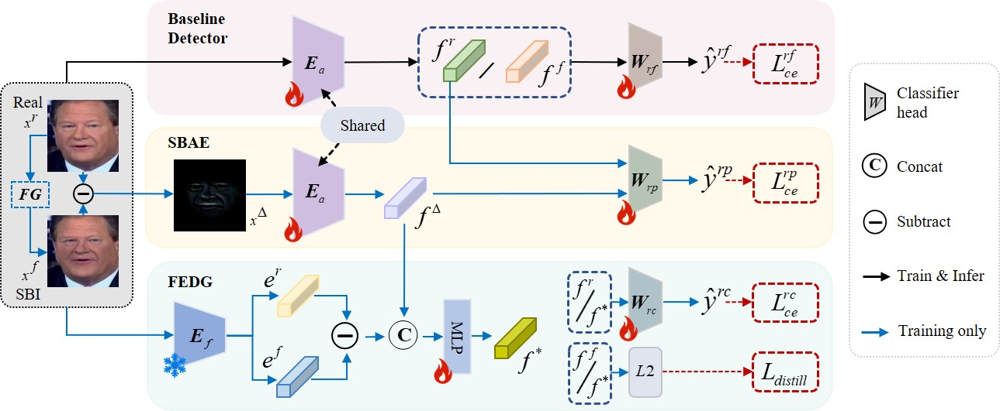

# Deepfake Detection Leveraging Self-Blended Artifacts Guided by Facial Embedding Discrepancy
  
# Introduction
This study presents a novel approach to deepfake detection that utilizes self-blended artifacts guided by facial embedding discrepancy。This method likely involves using facial embedding differences to guide self-blended artifacts, aiming to improve the accuracy of deepfake detection。
# Recomended Development Environment
* GPU: NVIDIA 3090
* CUDA: 11.7

# Setup
## 1. Installation
1. Create conda environment with Python=3.8 
    ```bash
    conda create -n myenv python=3.8
    conda activate myenv
    ````
2. Install pytorch 2.0.1, torchvision 0.15.2 with compatible cuda version
    ```bash
    pip install torch==2.0.1+cu117 torchvision==0.15.2+cu117 -f https://download.pytorch.org/whl/torch_stable.html
    ```
3. Install required packages

## 2. Dataset
Download datasets. For example, download [Celeb-DF-v2](https://github.com/yuezunli/celeb-deepfakeforensics) and place it:
```
.
└── data
    └── Celeb-DF-v2
        ├── Celeb-real
        │   └── videos
        │       └── *.mp4
        ├── Celeb-synthesis
        │   └── videos
        │       └── *.mp4
        ├── Youtube-real
        │   └── videos
        │       └── *.mp4
        └── List_of_testing_videos.txt
```
For other datasets, please refer to `./data/datasets.md` .


## 3. Pretrained model
We provide weights of EfficientNet-B4 trained on SBIs from FF-raw.  
Download [[pre-weights](https://pan.quark.cn/s/b125cd8a256e)] and place it in `./weights/` folder.


# 4. Test
First store the data as a .npy file. For example, run the inference on Celeb-DF-v2:
   ```bash
   python3 src/inference/img2npy.py
   ```
   ```bash
   python3 src/inference/inference.py \
   -w weights/EG-weights.tar \
   -d CDF
   ```

# 5. Training
1. Download [FF++](https://github.com/ondyari/FaceForensics) real videos and place them in `./data/` folder:
   ```
   .
   └── data
       └── FaceForensics++
           ├── original_sequences
           │   └── youtube
           │       └── raw
           │           └── videos
           │               └── *.mp4
           ├── train.json
           ├── val.json
           └── test.json
   ```
2. Download landmark detector (shape_predictor_81_face_landmarks.dat) from [here](https://github.com/codeniko/shape_predictor_81_face_landmarks) and place it in `./src/preprocess/` folder.

3. You can download code for landmark augmentation:
   ```bash
   mkdir src/utils/library
   git clone https://github.com/AlgoHunt/Face-Xray.git src/utils/library
   ```

4. Run the two codes to extractvideo frames, landmarks, and bounding boxes:
   ```bash
   python3 src/preprocess/crop_dlib_ff.py -d Original
   CUDA_VISIBLE_DEVICES=* python3 src/preprocess/crop_retina_ff.py -d Original
   ```
5. Run the training:
   ```bash
   python3 src/train.py \
   src/configs/sbi/base.json \
   -n sbi
   ```
