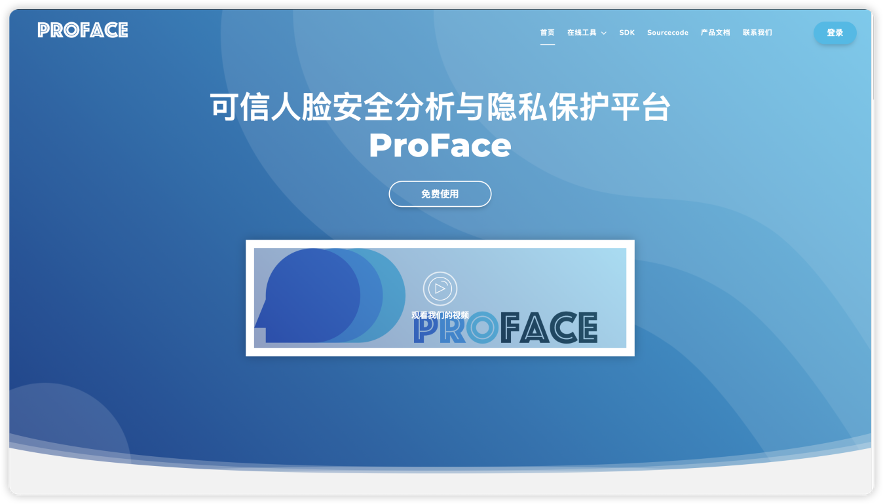

## Web Protal Environment
  Due to potential conflicts between certain dependency packages during the environment setup, they need to be installed step-by-step
    pip install  torch==1.12.0 torchvision==0.13.0 torchaudio==0.12.0
    pip install insightface==0.2.1
    pip install opencv
    pip install numpy==1.26.2
    pip install flask
    pip install flask_socketio
## Quick Start
Run this script: main.py
## Preview
The homepage of the project after successful setup and operation is shown in the figure below

## Link 
weights in this project is avaliable

download four [pre-trained face recognition model weights](https://pan.baidu.com/s/12BhQkR8YBp9ergCmIR2H-A)(Password: wbnz) to this path：Makeupprivacy/Pretrained_FR_Models/

download the [pre-trained face parsing model weights](https://pan.baidu.com/s/1_1uyZuWHXmmovMvwFt1J1g)(Password: grr5) to this path：Makeupprivacy/models/networks/face_parsing/

Download the [trained model weights](https://pan.baidu.com/s/1m5LukyEqoOIE90tl31jHbA)(Password: n8bw)to this path：Makeupprivacy/checkpoints/1_facenet_multiscale=2/Hinet_weights

Download the [swap model weights](链接: https://pan.baidu.com/s/1JE8x2jC4kzONdLBZnfNtSw)(Password: qc29)to this path：Checkpoints/

Download the [[pre-weights](https://pan.quark.cn/s/b125cd8a256e)] to this path：forgery/weights/

